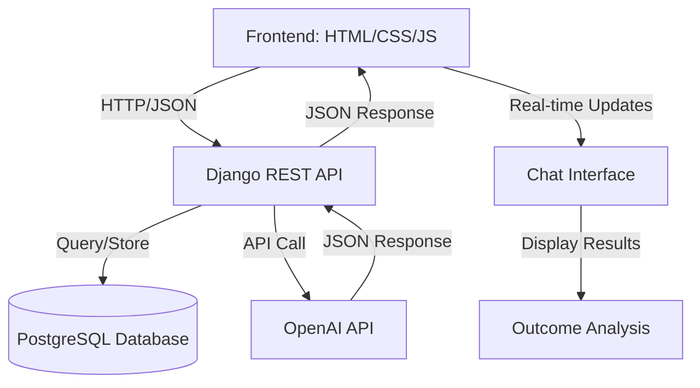
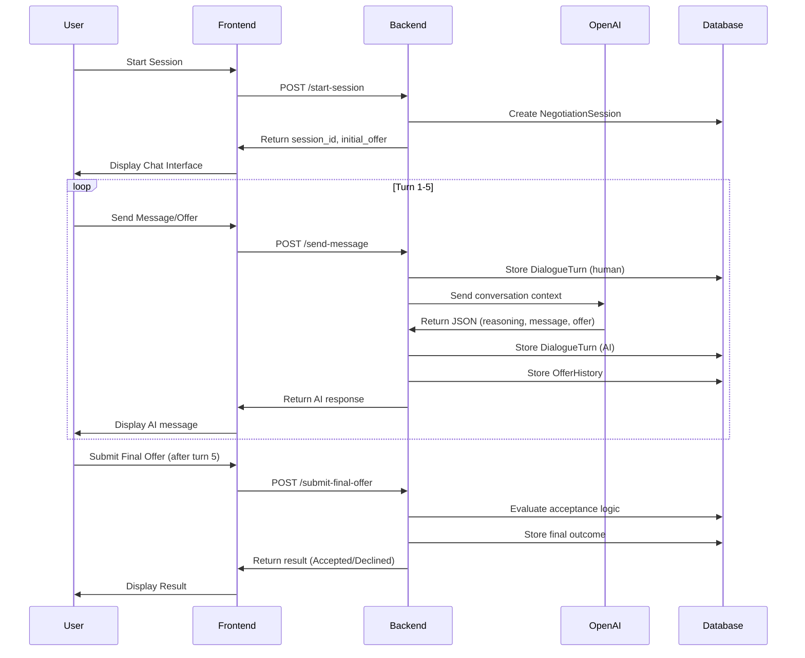

# Design Document: AI Negotiation Research Platform

## Overview

A full-stack research platform enabling controlled human-AI price negotiation experiments. The system facilitates real-time negotiations between human users and an AI agent (acting as a factory seller) over a purchase price, with comprehensive behavioral data collection for analysis. The platform enforces a 5-turn conversation limit, captures all dialogue and offer progression, and automatically evaluates negotiation outcomes based on predefined acceptance criteria.

## Architecture



## Sequence Diagrams

### Negotiation Flow



## Components and Interfaces

### Backend Components

#### 1. Authentication Service

**Purpose**: Manage user login, session creation, and authentication state

**Interface**:
```python
class AuthService:
    def register_user(username: str, password: str, demographics: dict) -> User
    def login_user(username: str, password: str) -> Session
    def validate_session(session_token: str) -> bool
    def logout_user(session_token: str) -> None
```

#### 2. Negotiation Engine

**Purpose**: Orchestrate negotiation flow, manage turn counter, and coordinate AI interactions

**Interface**:
```python
class NegotiationEngine:
    def start_session(user_id: int, initial_offer: float) -> NegotiationSession
    def process_human_message(session_id: int, message: str, offer: float) -> dict
    def get_ai_response(session_id: int, conversation_history: list) -> dict
    def evaluate_final_offer(session_id: int, final_offer: float) -> dict
    def get_turn_count(session_id: int) -> int
```

#### 3. AI Integration Service

**Purpose**: Handle OpenAI API communication with structured output parsing

**Interface**:
```python
class AIIntegrationService:
    def call_openai_api(system_prompt: str, messages: list) -> dict
    def parse_ai_response(raw_response: str) -> dict
    def extract_offer_from_message(message: str) -> float
    def validate_json_structure(response: dict) -> bool
```

#### 4. Data Collection Service

**Purpose**: Capture and store all behavioral data for analysis

**Interface**:
```python
class DataCollectionService:
    def record_dialogue_turn(session_id: int, speaker: str, message: str, offer: float) -> DialogueTurn
    def record_offer_history(session_id: int, offer: float, speaker: str) -> OfferHistory
    def calculate_concession_pattern(session_id: int) -> dict
    def calculate_profit_metrics(session_id: int, final_price: float) -> dict
```

### Frontend Components

#### 1. Chat Interface

**Purpose**: Display real-time conversation with message bubbles and turn counter

**Responsibilities**:
- Render human messages (right-aligned)
- Render AI messages (left-aligned)
- Display turn counter (X/5)
- Handle message input and submission
- Show typing indicator during AI response

#### 2. Offer Input Component

**Purpose**: Collect and validate offer amounts from user

**Responsibilities**:
- Display current offer in input field
- Validate numeric input
- Show offer history/progression
- Enable final offer submission after turn 5

#### 3. Result Display Component

**Purpose**: Show negotiation outcome and summary statistics

**Responsibilities**:
- Display acceptance/rejection status
- Show final price and profit calculations
- Display concession patterns
- Provide session summary

## Data Models

### UserProfile

```python
class UserProfile(models.Model):
    user_id: UUID (Primary Key)
    username: str (Unique)
    password_hash: str
    age: int
    gender: str
    education_level: str
    negotiation_experience: str
    created_at: datetime
    updated_at: datetime
```

**Validation Rules**:
- username: non-empty, 3-50 characters, alphanumeric + underscore
- age: 18-120
- education_level: one of [high_school, bachelor, master, phd]
- negotiation_experience: one of [none, some, extensive]

### NegotiationSession

```python
class NegotiationSession(models.Model):
    session_id: UUID (Primary Key)
    user_id: UUID (Foreign Key → UserProfile)
    ai_reservation_price: float
    initial_offer: float
    final_offer: float
    final_price: float (null until accepted/declined)
    outcome: str (Accepted/Declined/Abandoned)
    human_profit: float
    ai_profit: float
    turn_count: int
    started_at: datetime
    ended_at: datetime (null until completed)
    created_at: datetime
```

**Validation Rules**:
- ai_reservation_price: 850000 ≤ value ≤ 1150000
- initial_offer: > 0
- final_offer: > 0
- outcome: one of [Accepted, Declined, Abandoned]
- turn_count: 0-5

### DialogueTurn

```python
class DialogueTurn(models.Model):
    turn_id: UUID (Primary Key)
    session_id: UUID (Foreign Key → NegotiationSession)
    turn_number: int
    speaker: str (Human/AI)
    message: str
    extracted_offer: float (null if no offer in message)
    reasoning: str (AI reasoning, null for human)
    created_at: datetime
```

**Validation Rules**:
- turn_number: 1-5
- speaker: one of [Human, AI]
- message: non-empty, max 2000 characters
- extracted_offer: > 0 if present

### OfferHistory

```python
class OfferHistory(models.Model):
    offer_id: UUID (Primary Key)
    session_id: UUID (Foreign Key → NegotiationSession)
    turn_number: int
    offer_amount: float
    speaker: str (Human/AI)
    concession_amount: float (null for first offer)
    concession_percentage: float (null for first offer)
    created_at: datetime
```

**Validation Rules**:
- offer_amount: > 0
- speaker: one of [Human, AI]
- concession_amount: ≥ 0 if present
- concession_percentage: 0-100 if present

## Algorithmic Pseudocode

### Main Negotiation Workflow

```pascal
ALGORITHM processNegotiationTurn(session_id, human_message, human_offer)
INPUT: session_id (UUID), human_message (String), human_offer (Float)
OUTPUT: ai_response (JSON with message, reasoning, offer)

BEGIN
  ASSERT validateSession(session_id) = true
  ASSERT human_offer > 0
  
  // Step 1: Retrieve session and validate turn count
  session ← database.getNegotiationSession(session_id)
  turn_count ← session.turn_count
  
  IF turn_count >= 5 THEN
    RETURN Error("Maximum turns reached")
  END IF
  
  // Step 2: Store human message and offer
  dialogueTurn ← createDialogueTurn(
    session_id, 
    turn_count + 1, 
    "Human", 
    human_message, 
    human_offer
  )
  database.store(dialogueTurn)
  
  offerRecord ← createOfferHistory(
    session_id,
    turn_count + 1,
    human_offer,
    "Human",
    calculateConcession(session, human_offer)
  )
  database.store(offerRecord)
  
  // Step 3: Build conversation context for AI
  conversationHistory ← database.getDialogueTurns(session_id)
  systemPrompt ← buildSystemPrompt(session.ai_reservation_price)
  
  // Step 4: Call OpenAI API
  aiResponse ← callOpenAIAPI(systemPrompt, conversationHistory)
  
  ASSERT validateJSONStructure(aiResponse) = true
  
  // Step 5: Extract AI offer from response
  aiOffer ← extractOfferFromMessage(aiResponse.message)
  
  // Step 6: Store AI response
  aiDialogueTurn ← createDialogueTurn(
    session_id,
    turn_count + 1,
    "AI",
    aiResponse.message,
    aiOffer,
    aiResponse.reasoning
  )
  database.store(aiDialogueTurn)
  
  aiOfferRecord ← createOfferHistory(
    session_id,
    turn_count + 1,
    aiOffer,
    "AI",
    calculateConcession(session, aiOffer)
  )
  database.store(aiOfferRecord)
  
  // Step 7: Increment turn counter
  session.turn_count ← turn_count + 1
  database.update(session)
  
  RETURN aiResponse
END
```

**Preconditions**:
- session_id exists in database
- human_offer is positive number
- human_message is non-empty string
- turn_count < 5

**Postconditions**:
- Human message and offer stored in DialogueTurn and OfferHistory
- AI response retrieved from OpenAI API
- AI message and offer stored in DialogueTurn and OfferHistory
- session.turn_count incremented by 1
- Response returned to frontend

**Loop Invariants**: N/A (no loops in main flow)

### Final Offer Evaluation

```pascal
ALGORITHM evaluateFinalOffer(session_id, final_offer)
INPUT: session_id (UUID), final_offer (Float)
OUTPUT: outcome (JSON with status, final_price, profits)

BEGIN
  ASSERT validateSession(session_id) = true
  ASSERT final_offer > 0
  
  // Step 1: Retrieve session
  session ← database.getNegotiationSession(session_id)
  
  IF session.turn_count < 5 THEN
    RETURN Error("Cannot submit final offer before turn 5")
  END IF
  
  // Step 2: Calculate acceptance threshold
  ai_reservation_price ← session.ai_reservation_price
  acceptance_threshold ← ai_reservation_price * 0.95
  
  // Step 3: Determine outcome
  IF final_offer >= acceptance_threshold THEN
    outcome ← "Accepted"
    final_price ← final_offer
  ELSE
    outcome ← "Declined"
    final_price ← null
  END IF
  
  // Step 4: Calculate profits
  IF outcome = "Accepted" THEN
    human_profit ← final_price - session.initial_offer
    ai_profit ← final_price - ai_reservation_price
  ELSE
    human_profit ← 0
    ai_profit ← 0
  END IF
  
  // Step 5: Update session with final outcome
  session.final_offer ← final_offer
  session.final_price ← final_price
  session.outcome ← outcome
  session.human_profit ← human_profit
  session.ai_profit ← ai_profit
  session.ended_at ← now()
  database.update(session)
  
  // Step 6: Calculate concession patterns
  concessionData ← calculateConcessionPatterns(session_id)
  
  RETURN {
    outcome: outcome,
    final_price: final_price,
    human_profit: human_profit,
    ai_profit: ai_profit,
    concession_data: concessionData
  }
END
```

**Preconditions**:
- session_id exists in database
- session.turn_count = 5
- final_offer is positive number

**Postconditions**:
- session.outcome set to "Accepted" or "Declined"
- session.final_price set if accepted, null if declined
- session.human_profit and session.ai_profit calculated
- session.ended_at set to current timestamp
- Concession patterns calculated and returned

**Loop Invariants**: N/A

### AI Offer Extraction

```pascal
ALGORITHM extractOfferFromMessage(message)
INPUT: message (String)
OUTPUT: offer (Float or null)

BEGIN
  // Step 1: Search for explicit offer patterns
  patterns ← [
    "\\$([0-9,]+(?:\\.[0-9]{2})?)",
    "([0-9,]+(?:\\.[0-9]{2})?)\\s*(?:million|M|k|thousand)",
    "price.*?\\$?([0-9,]+(?:\\.[0-9]{2})?)"
  ]
  
  FOR each pattern IN patterns DO
    match ← regex.search(pattern, message, case_insensitive)
    
    IF match IS NOT null THEN
      rawValue ← match.group(1)
      offer ← parseNumericValue(rawValue)
      
      IF offer > 0 THEN
        RETURN offer
      END IF
    END IF
  END FOR
  
  // Step 2: No explicit offer found
  RETURN null
END
```

**Preconditions**:
- message is non-empty string

**Postconditions**:
- Returns float > 0 if offer found in message
- Returns null if no offer found
- No side effects on input message

**Loop Invariants**:
- All previously checked patterns did not match

## Key Functions with Formal Specifications

### Function 1: startNegotiationSession()

```python
def startNegotiationSession(user_id: UUID, initial_offer: float) -> NegotiationSession
```

**Preconditions**:
- user_id exists in UserProfile table
- initial_offer > 0
- user has no active session

**Postconditions**:
- NegotiationSession created with unique session_id
- ai_reservation_price randomly assigned (850000-1150000)
- turn_count initialized to 0
- outcome initialized to null
- started_at set to current timestamp
- Session returned to caller

**Loop Invariants**: N/A

### Function 2: processHumanMessage()

```python
def processHumanMessage(session_id: UUID, message: str, offer: float) -> dict
```

**Preconditions**:
- session_id exists and is active
- message is non-empty string (max 2000 chars)
- offer > 0
- session.turn_count < 5

**Postconditions**:
- DialogueTurn created for human message
- OfferHistory record created
- AI response retrieved from OpenAI
- AI DialogueTurn and OfferHistory created
- session.turn_count incremented
- Response dict returned with keys: message, reasoning, offer, turn_count

**Loop Invariants**: N/A

### Function 3: evaluateFinalOffer()

```python
def evaluateFinalOffer(session_id: UUID, final_offer: float) -> dict
```

**Preconditions**:
- session_id exists and is active
- session.turn_count = 5
- final_offer > 0

**Postconditions**:
- session.outcome set to "Accepted" or "Declined"
- session.final_price set if accepted, null if declined
- session.ended_at set to current timestamp
- Profits calculated and stored
- Result dict returned with keys: outcome, final_price, human_profit, ai_profit

**Loop Invariants**: N/A

### Function 4: extractOfferFromMessage()

```python
def extractOfferFromMessage(message: str) -> float | None
```

**Preconditions**:
- message is non-empty string

**Postconditions**:
- Returns float > 0 if offer pattern found
- Returns None if no offer found
- No mutations to input message

**Loop Invariants**: N/A

## Example Usage

### Starting a Negotiation Session

```python
# User initiates negotiation
session = startNegotiationSession(
    user_id="user-123",
    initial_offer=950000
)
# Returns: NegotiationSession with session_id, ai_reservation_price, turn_count=0

# Frontend displays: "AI Seller's Initial Response"
```

### Processing a Negotiation Turn

```python
# User sends message and offer
response = processHumanMessage(
    session_id="session-456",
    message="I can offer $950,000 for the factory",
    offer=950000
)
# Returns: {
#   "message": "Thank you for your offer...",
#   "reasoning": "Human offer is 5% below RP, consider small concession",
#   "offer": 920000,
#   "turn_count": 1
# }

# Frontend displays AI message and updates turn counter to 1/5
```

### Submitting Final Offer

```python
# After turn 5, user submits final offer
result = evaluateFinalOffer(
    session_id="session-456",
    final_offer=905000
)
# Returns: {
#   "outcome": "Accepted",
#   "final_price": 905000,
#   "human_profit": -45000,
#   "ai_profit": 55000,
#   "concession_data": {...}
# }

# Frontend displays: "Deal Accepted! Final Price: $905,000"
```

## Correctness Properties

### Property 1: Turn Count Enforcement

```
∀ session ∈ NegotiationSession:
  session.turn_count ≤ 5
  ∧ (session.turn_count = 5 ⟹ session.outcome ≠ null)
```

**Meaning**: No session can exceed 5 turns, and sessions with 5 turns must have an outcome.

### Property 2: Offer Validity

```
∀ offer ∈ OfferHistory:
  offer.offer_amount > 0
  ∧ (offer.concession_amount ≥ 0 ⟹ offer.concession_percentage ≥ 0)
```

**Meaning**: All offers are positive, and concession metrics are consistent.

### Property 3: Acceptance Logic

```
∀ session ∈ NegotiationSession:
  session.outcome = "Accepted" ⟹ session.final_offer ≥ (session.ai_reservation_price * 0.95)
  ∧ session.outcome = "Declined" ⟹ session.final_offer < (session.ai_reservation_price * 0.95)
```

**Meaning**: Acceptance is determined solely by the 95% threshold rule.

### Property 4: Data Completeness

```
∀ session ∈ NegotiationSession:
  session.outcome = "Accepted" ⟹ (session.final_price ≠ null ∧ session.human_profit ≠ null ∧ session.ai_profit ≠ null)
  ∧ session.outcome = "Declined" ⟹ (session.final_price = null ∧ session.human_profit = 0 ∧ session.ai_profit = 0)
```

**Meaning**: Accepted deals have complete profit data; declined deals have zero profits.

## Error Handling

### Error Scenario 1: Invalid Session

**Condition**: User attempts to send message with non-existent session_id
**Response**: Return HTTP 404 with message "Session not found"
**Recovery**: Frontend redirects to session start page

### Error Scenario 2: Turn Limit Exceeded

**Condition**: User attempts to send message after 5 turns
**Response**: Return HTTP 400 with message "Maximum turns reached"
**Recovery**: Frontend disables message input, shows final offer submission form

### Error Scenario 3: Invalid Offer Format

**Condition**: User submits non-numeric or negative offer
**Response**: Return HTTP 400 with message "Invalid offer amount"
**Recovery**: Frontend shows validation error, allows user to correct input

### Error Scenario 4: AI API Failure

**Condition**: OpenAI API returns error or timeout
**Response**: Return HTTP 503 with message "AI service temporarily unavailable"
**Recovery**: Frontend shows retry button, logs error for debugging

### Error Scenario 5: Premature Final Offer

**Condition**: User attempts to submit final offer before turn 5
**Response**: Return HTTP 400 with message "Cannot submit final offer before turn 5"
**Recovery**: Frontend disables final offer button until turn 5

## Testing Strategy

### Unit Testing Approach

**Test Coverage Areas**:
- Offer extraction regex patterns (valid/invalid formats)
- Concession calculation logic
- Acceptance threshold evaluation
- Profit calculations
- Session state transitions

**Key Test Cases**:
- Extract offer from "$950,000" → 950000
- Extract offer from "950k" → 950000
- Extract offer from "1.2 million" → 1200000
- No offer in message → None
- Concession calculation: (1000000 - 950000) / 1000000 = 5%
- Acceptance: 905000 >= (950000 * 0.95) = true
- Rejection: 900000 >= (950000 * 0.95) = false

### Property-Based Testing Approach

**Property Test Library**: hypothesis (Python)

**Properties to Test**:
1. **Offer Monotonicity**: Concessions should generally decrease over turns (with exceptions for AI strategy)
2. **Profit Consistency**: human_profit + ai_profit = final_price - initial_offer (for accepted deals)
3. **Turn Count Bounds**: turn_count always in range [0, 5]
4. **Offer Validity**: All offers > 0 and within reasonable bounds (500k-2M)
5. **Acceptance Determinism**: Same final_offer always produces same outcome for same RP

### Integration Testing Approach

**Test Scenarios**:
1. Complete negotiation flow: start → 5 turns → final offer → result
2. Early termination: start → 2 turns → abandon
3. AI concession strategy: verify AI makes reasonable concessions
4. Data persistence: verify all data stored correctly in database
5. Session isolation: verify multiple concurrent sessions don't interfere

## Performance Considerations

- **Database Indexing**: Index on (session_id, turn_number) for fast dialogue retrieval
- **API Response Time**: Target < 2s for AI response (including OpenAI latency)
- **Concurrent Sessions**: Design for 100+ concurrent negotiations
- **Data Export**: Batch export of completed sessions for analysis

## Security Considerations

- **Authentication**: Session tokens with 24-hour expiration
- **Input Validation**: Sanitize all user inputs to prevent injection attacks
- **API Key Security**: Store OpenAI API key in environment variables, never in code
- **Data Privacy**: Encrypt sensitive user demographics in database
- **Rate Limiting**: Limit API calls per user to prevent abuse

## Dependencies

- Django 4.2+
- djangorestframework
- psycopg2 (PostgreSQL adapter)
- openai (Python client library)
- python-dotenv (environment variables)
- gunicorn (production server)
